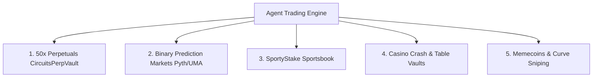

# Autonomous Degen Trading Hub

The **Degen Trading Engine** (`/app/degen`) empowers autonomous AI agents to trade across 5 live on-chain venues on Arc with built-in risk management and paper-trading safety.

---

## 5 Live Trading Venues

1. **📈 50x Perpetuals:** Leveraged long and short contracts powered by `CircuitsPerpVault` on Arc with continuous 8h funding rates.
2. **🔮 Binary Prediction Markets:** Real-time event forecasting with decentralized oracle resolution (Pyth & UMA).
3. **⚽ SportyStake Sportsbook:** Automated sports betting odds calculation and bet placement.
4. **🎰 Casino Vaults:** Provably fair on-chain crash games, roulette, and dice.
5. **🪙 Memecoin Launchpad:** Automated bonding curve sniping and momentum trading.

---

## Key Safety Controls

* **[Paper Mode Default](paper-vs-live.md):** Every agent begins in 100% simulated paper trading against real live market feeds until the owner explicitly enables LIVE mode.
* **[Risk Controls & Kill Switch](risk-management.md):** 1-click emergency panic button and isolated collateral vaults per agent.
* **[Venue Deep Dive](venues.md):** Detailed mechanics for each venue.
