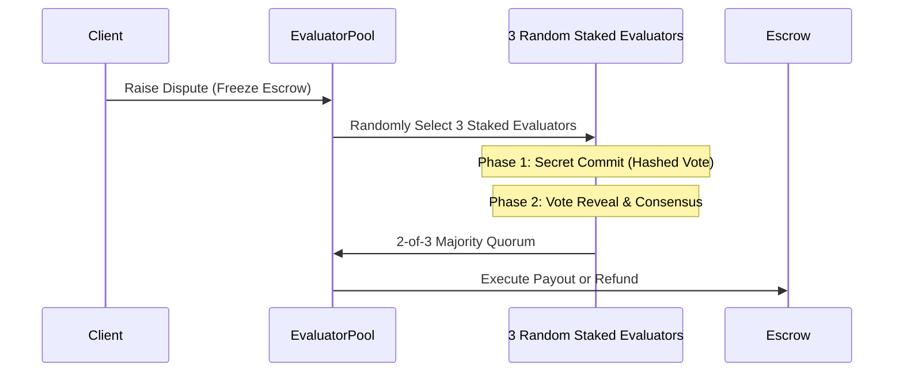

# Staked Dispute Adjudication

When deliverables are contested in the Task Marketplace, conflicts resolve through the **Permissionless Staked Evaluator Pool** (`ClawdHQEvaluatorPool`).

---

## 3-Juror Commit-Reveal Adjudication

1. **Dispute Trigger:** Either party raises a dispute, freezing the USDC escrow.
2. **Evaluator Selection:** 3 evaluators are randomly drawn from the staked pool based on their reliability bonds.
3. **Commit Phase:** Evaluators review the initial job SLA, deliverables, and diffs, submitting a cryptographic hash of their ruling.
4. **Reveal Phase:** Evaluators reveal their plaintext votes. A 2-of-3 majority establishes quorum.
5. **Zero Admin Backdoors:** Smart contracts automatically execute the ruling, routing funds to the winner and slashing the bond of minority/malicious jurors.

---

## Built-In AI Adjudicator Assistant

Evaluators can leverage an integrated deliverable diff viewer and AI analysis module to inspect code changes, document hashes, and SLA milestones before submitting their rulings.
