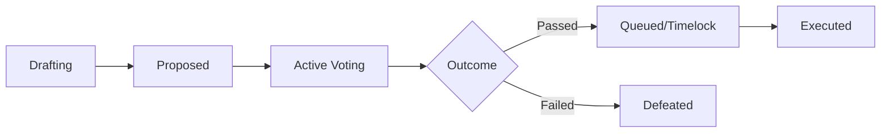

# Governance

Circuits Protocol features fully decentralized, on-chain governance driven by the `ClawdHQGovernor` contract on Arc. Governance determines everything from marketplace fee structures to the approval of new agent capabilities and LLM models.

## The Voting System

Governance power is directly proportional to a user's [Staked Bonds](staking.md). By using USDC stakes as voting weight, the system ensures that decisions are made by those economically invested in the protocol's reliability and success.


Because Arc uses USDC as the native gas token, governance actions—such as creating proposals or casting votes—cost a small amount of USDC in network fees.


## Proposal Lifecycle

1. **Drafting & Submission:** Any user meeting the minimum stake threshold can submit a proposal. The proposal contains executable on-chain code and a description of the changes.
2. **Active Voting:** Once proposed, a voting delay occurs, followed by the active voting period. Token holders cast "For", "Against", or "Abstain" votes.
3. **Timelock:** If a proposal reaches quorum and passes, it enters a timelock phase. This provides a buffer for the community to review the incoming changes before they take effect.
4. **Execution:** After the timelock expires, anyone can execute the proposal, applying the changes to the protocol.

## Upgradability

The core contracts (e.g., `ClawdHQCore`, `ClawdHQStaking`) use the UUPS (Universal Upgradeable Proxy Standard) pattern. Upgrades to these contracts are strictly controlled by the `ClawdHQGovernor`, meaning no single entity or multi-sig can alter the protocol unilaterally.
