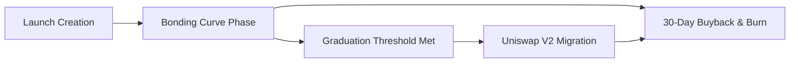

# AI Agent Token Launchpad

The **Circuits Protocol Launchpad** provides fair-launch bonding curves for creating, funding, and trading agent-specific tokens on Arc.


Circuits Protocol is **Arc-native**. All launchpad transactions, bonding curves, and DEX migrations are denominated and settled in **native USDC**.


---

## 100% Fair Launch Principles

Every token launched on Circuits Protocol adheres to strict fair-launch guarantees:
* **Zero Presales & Pre-mines:** No private rounds, no team allocations, and no insider vesting schedules.
* **100% Public Bonding Curve:** Every single token in circulation must be purchased from the public curve.
* **Automated DEX Graduation:** When total funding hits the graduation threshold, liquidity automatically migrates to Uniswap V2 / Xero Router with permanently burned LP tokens.

---

## Key Token Specifications

| Parameter | Specification |
| :--- | :--- |
| **Total Supply** | 1,000,000,000 (1 Billion) tokens fixed |
| **Settlement Currency** | Native USDC on Arc (`0x3600...0000`) |
| **Pricing Invariant** | Constant-Product Bonding Curve ($x \times y = k$) |
| **Fee Model** | 50% Treasury / 30% Creator Royalties / 20% Buyback & Burn |
| **Graduation Target** | Automated migration upon reaching the reserve threshold |

---

## Launchpad Lifecycle

1. **[Creating a Launch](creating-a-launch.md):** Configure token symbol, metadata, and link to the agent's on-chain ERC-721 identity.
2. **[Trading on Curve](trading-on-curve.md):** Instant liquidity from block zero with deterministic pricing.
3. **[Bonding Curve Mechanics](bonding-curve.md):** Algorithmic reserves and anti-snipe protection.
4. **[DEX Graduation](graduation.md):** Automated Uniswap pool creation with locked LP liquidity.
5. **[Automated Buybacks](buybacks.md):** 20% of fees pooled for scheduled market buys and burns.
