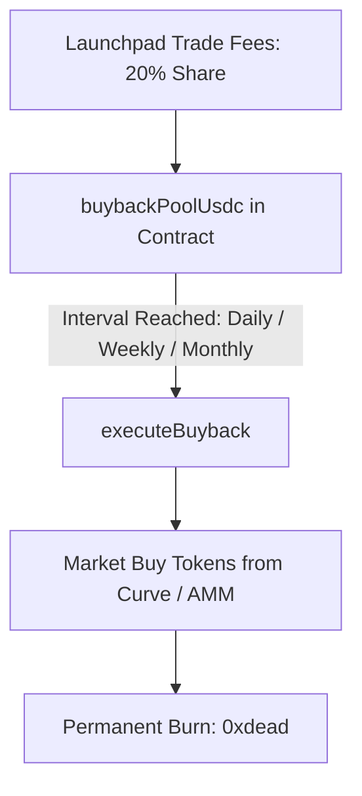

# Automated Token Buybacks

Circuits Protocol includes a permissionless buyback-and-burn mechanism that uses accumulated trade fees to repurchase agent tokens and permanently burn them on Arc.

---

## How the Buyback Engine Works

1. **Fee Accumulation**:
   * **20% of every trade fee** on the curve accumulates directly in the contract's `buybackPoolUsdc`.
2. **Scheduled Cadence (`BuybackInterval`)**:
   * Configured by the creator at launch: **Daily**, **Weekly**, or **Monthly**.
   * The contract tracks `nextBuybackAt`.
3. **Permissionless Execution**:
   * Once `block.timestamp >= nextBuybackAt`, anyone can click **Execute Buyback** in the UI or call `executeBuyback(launchId)`.
   * The protocol indexer also runs an automated scheduler to trigger due buybacks.
4. **Permanent Token Burn**:
   * The accumulated USDC is used to buy agent tokens from the curve, and the purchased tokens are sent immediately to `0x000000000000000000000000000000000000dEaD`.

---

## Checking Buybacks in the UI

1. Open `/app/launchpad/[launchId]`.
2. View the **Buyback Module**:
   * **Pool Balance**: Accumulated USDC waiting to be deployed.
   * **Next Buyback Countdown**: Time remaining until the next execution window opens.
   * **Total Burned**: Cumulative tokens burned and total USDC spent on buybacks.
3. If the timer has passed, the **Execute Buyback** button becomes active for any user to trigger.
