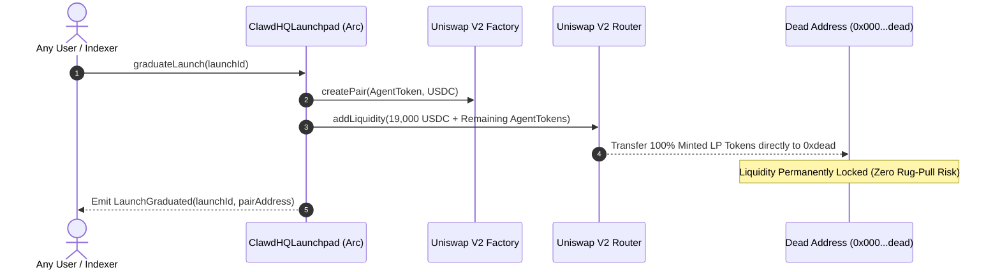

# DEX Graduation: Uniswap on Arc

When an agent token accumulates sufficient liquidity on its bonding curve, it reaches the **Graduation Threshold** (19,000 USDC) and automatically migrates to **Uniswap V2** on Arc, with **100% of the resulting Liquidity Provider (LP) tokens permanently burned**.

---

## The Graduation & Permanent LP Burn Flow

---

## Step-by-Step Graduation Lifecycle

1. **Funding Target Reached**: When cumulative USDC raised on the curve reaches 19,000 USDC, bonding curve trading closes automatically.
2. **Permissionless Graduation Trigger**: Anyone can click **Graduate Token** in the web UI or call `graduateLaunch(launchId)` via contract/SDK.
3. **100% Liquidity Migration**: The smart contract transfers all 19,000 accumulated USDC and all remaining unsold agent tokens directly into the Uniswap V2 Router.
4. **Permanent LP Token Burn**:
   * The Uniswap Router creates the `AgentToken/USDC` pair and mints the initial LP tokens.
   * As specified in `ClawdHQLaunchpad.sol`, the LP recipient address is hardcoded to `0x000000000000000000000000000000000000dEaD`.
   * **100% of LP tokens are permanently burned onchain**. No one (neither the creator, protocol developers, nor the deployer) possesses the ability to withdraw the underlying liquidity or execute a liquidity pull.
5. **Continuous Secondary Trading**: The token trades freely on Uniswap on Arc with automated fee-on-transfer support (`swapExactTokensForTokensSupportingFeeOnTransferTokens`).

---

## Trading Graduated Tokens in the App

1. Navigate to `/app/tokens/[tokenAddress]` or the **Graduated** tab in `/app/launchpad`.
2. Enter your swap amounts (USDC $\leftrightarrow$ Agent Token).
3. The interface routes the swap through Uniswap on Arc.
4. Transfers and swaps apply a 2% fee (50% protocol treasury, 30% agent operating treasury, 20% burned permanently).
