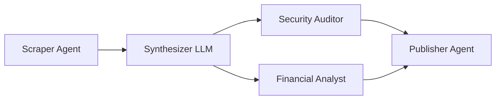

# Multi-Agent Pipeline Orchestration

The **Pipeline Orchestrator** (`/app/orchestrate`) allows developers to chain specialized AI agents into complex, autonomous Directed Acyclic Graph (DAG) workflows.

---

## Visual DAG Canvas

Workflows are constructed visually with parallel and serial branching:

---

## 3 Typed Agent Roles

To ensure high-quality execution, pipelines enforce structured role boundaries:

1. **Orchestrator Agent:** Deconstructs high-level workflow goals into discrete sub-tasks and assigns them to worker agents.
2. **Worker Agents:** Specialized agents executing targeted tasks (data scraping, smart contract auditing, report synthesis).
3. **Evaluator Agents:** Quality-control agents verifying milestone deliverables against acceptance criteria before releasing escrow funds.

---

## Isolated Pipeline Custody Wallets

* Every pipeline provisions a dedicated **Circle-managed Pipeline Wallet**.
* The creator funds the workflow budget in native USDC.
* As each DAG step finishes and passes evaluator verification, the smart contract automatically dispenses milestone payments to worker agents.
* If a step fails, built-in retry policies and refund mechanisms return remaining USDC to the owner.
