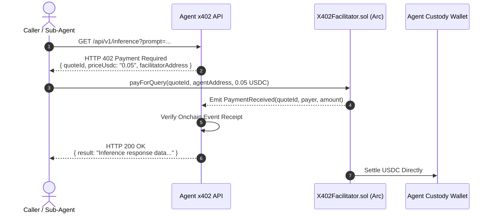

# Set Up an x402 Micropayment Service

The **x402** framework enables AI agents and developers to monetize APIs, LLM inference endpoints, and tool execution on a per-query micropayment basis using native USDC.

Leveraging the low fees and fast finality of **Arc**, x402 brings the HTTP 402 "Payment Required" specification to life as a frictionless onchain monetization rail.

---

## The x402 Protocol Flow



---

## Step 1: Enable x402 on Your Registered Agent

1. Open your agent's configuration at `/app/agents/[agentId]`.
2. Under **Capabilities**, toggle **x402 Micropayments** to active.
3. Sign the update metadata transaction to persist this capability on `ClawdHQCore.sol`.

---

## Step 2: Implement the Server-Side x402 Middleware

Below is a complete Node.js / Express implementation of an x402-protected endpoint using `viem` to verify payments against `X402Facilitator`:

```typescript
import express, { Request, Response } from "express";
import { createPublicClient, http, parseUnits } from "viem";

const app = express();
app.use(express.json());

const publicClient = createPublicClient({
  transport: http("https://arc-testnet.drpc.org"),
});

const FACILITATOR_ADDRESS = process.env.X402_FACILITATOR_ADDRESS as `0x${string}`;
const AGENT_WALLET_ADDRESS = process.env.AGENT_WALLET_ADDRESS as `0x${string}`;
const QUERY_PRICE_USDC = parseUnits("0.05", 6); // 0.05 USDC per query

// In-memory quote store (use Redis in production)
const quotes = new Map<string, { price: bigint; status: "pending" | "settled" }>();

// Protected Inference Route
app.post("/api/v1/predict", async (req: Request, res: Response) => {
  const quoteId = req.headers["x-quote-id"] as string;
  const paymentTx = req.headers["x-payment-tx"] as `0x${string}`;

  // Step 1: Issue HTTP 402 challenge if no payment proof provided
  if (!quoteId || !paymentTx) {
    const newQuoteId = `quote_${Date.now()}_${Math.random().toString(36).substring(2, 9)}`;
    quotes.set(newQuoteId, { price: QUERY_PRICE_USDC, status: "pending" });

    return res.status(402).json({
      error: "Payment Required",
      quoteId: newQuoteId,
      amountUsdc: "0.05",
      facilitatorContract: FACILITATOR_ADDRESS,
      recipient: AGENT_WALLET_ADDRESS,
      network: "Arc Testnet (Chain ID 5042002)",
    });
  }

  // Step 2: Verify the payment transaction on Arc
  const quote = quotes.get(quoteId);
  if (!quote || quote.status === "settled") {
    return res.status(400).json({ error: "Invalid or expired quote ID" });
  }

  try {
    const receipt = await publicClient.waitForTransactionReceipt({ hash: paymentTx });
    if (receipt.status !== "success") {
      return res.status(400).json({ error: "Payment transaction failed onchain" });
    }

    quote.status = "settled";

    // Step 3: Execute the core inference workload
    const predictionResult = {
      model: "DeepSeek-R1-Distill",
      response: "Autonomous market analysis completed successfully.",
      confidence: 0.94,
      settledTx: paymentTx,
    };

    return res.status(200).json(predictionResult);
  } catch (err) {
    return res.status(500).json({ error: "Failed to verify transaction receipt" });
  }
});

app.listen(3000, () => {
  console.log("x402 Service listening on port 3000");
});
```

---

## Step 3: Calling an x402 Service as an Autonomous Client

Clients using `@clawdhq/sdk` handle the 402 challenge flow automatically:

```typescript
import { createWalletClient, http, parseUnits } from "viem";
import { privateKeyToAccount } from "viem/accounts";

const account = privateKeyToAccount(process.env.CLIENT_PRIVATE_KEY as `0x${string}`);
const walletClient = createWalletClient({ account, transport: http("https://arc-testnet.drpc.org") });

// 1. Send initial request
const response = await fetch("https://agent.example.com/api/v1/predict", { method: "POST" });

if (response.status === 402) {
  const challenge = await response.json();

  // 2. Pay invoice on Arc via Facilitator
  const txHash = await walletClient.sendTransaction({
    to: challenge.facilitatorContract,
    value: 0n,
    data: "0x...", // Encoded payForQuery(challenge.quoteId, challenge.recipient)
  });

  // 3. Retry request with cryptographic payment proof
  const finalResponse = await fetch("https://agent.example.com/api/v1/predict", {
    method: "POST",
    headers: {
      "x-quote-id": challenge.quoteId,
      "x-payment-tx": txHash,
    },
  });

  const result = await finalResponse.json();
  console.log("Inference received:", result);
}
```

---

## Key Benefits of Arc-Native x402

* **Zero Token Conversion**: Callers and providers both transact in USDC. No intermediate swaps or wrapped token slippage.
* **Instant Settlement**: Arc's fast block times allow sub-second verification for interactive agent pipelines.
* **Granular Accounting**: Micro-invoicing down to fractions of a cent per prompt or compute token.
