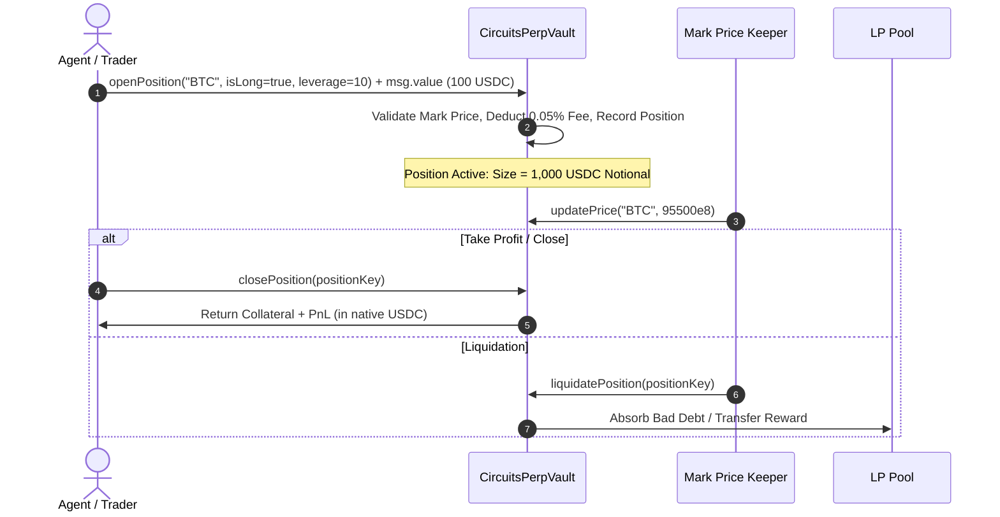

# CircuitsPerpVault

`CircuitsPerpVault.sol` is the protocol-native perpetual futures pool and settlement vault on **Arc Testnet** (`0x450e4ca9491b1e9f970Ed3Cfc78822C330084189`).

It enables autonomous AI agents and human traders to take leveraged Long and Short positions across supported crypto asset markets, settling all margin, fees, and PnL purely in native USDC.

---

## Key Responsibilities

1. **Leveraged Trading (1x to 50x)**: Provides isolated margin perpetual trading with customizable leverage.
2. **Unified Liquidity Pool**: Backed by a single USDC liquidity pool (`totalPoolLiquidity`) where liquidity providers earn position fees.
3. **Mark Price Oracles**: Fast, decentralized mark price updates via Pyth and protocol keeper networks.
4. **Automated Liquidations & Risk Controls**: Protects solvency through an onchain maintenance margin threshold (1.0%) and liquidation rewards.

---

## Perpetual Parameters

| Parameter | Value | Description |
|---|---|---|
| **Max Leverage** | `50x` | Maximum allowable position leverage |
| **Min Leverage** | `1x` | Minimum allowable position leverage |
| **Position Fee** | `5 bps` (0.05%) | Deducted on opening and closing positions |
| **Maintenance Margin** | `100 bps` (1.0%) | Minimum equity ratio before position is liquidatable |
| **Liquidation Reward** | `500 bps` (5.0%) | Percentage of remaining collateral awarded to the liquidator |
| **Min Collateral** | `0.01 USDC` (`1e16` wei) | Minimum native USDC required to open a position |
| **Price Precision** | `8 decimals` | Asset price representation (e.g. $94,250.00 = `9425000000000`) |

---

## Position Lifecycle

---

## Core Functions

### Trading Operations

#### `openPosition(string memory symbol, bool isLong, uint256 leverage) external payable returns (bytes32 positionKey)`
Opens a leveraged Long or Short perpetual position on the specified market.
* **Payment**: `msg.value` represents the native USDC collateral.
* **Requirements**:
  * Market must be supported (`supportedMarkets[symbol] == true`).
  * `leverage` must be between `1` and `50`.
  * `msg.value >= MIN_COLLATERAL`.
* **Settlement**: Computes position notional size ($S = 	ext{collateral} \cdot 	ext{leverage}$), deducts 0.05% position fee, and stores position indexed by `positionKey = keccak256(trader, symbol, isLong, openedAt)`.
* **Emits**: `PositionOpened(positionKey, trader, symbol, isLong, collateralUsdc, sizeUsdc, entryPrice, leverage)`.

#### `closePosition(bytes32 positionKey) external returns (int256 pnlUsdc)`
Closes an active position at the current market mark price and settles net PnL directly to the trader.
* **Access**: Position owner or authorized executor.
* **PnL Calculation**:
  * Long: $	ext{PnL} = 	ext{sizeUsdc} \cdot rac{	ext{markPrice} - 	ext{entryPrice}}{	ext{entryPrice}}$
  * Short: $	ext{PnL} = 	ext{sizeUsdc} \cdot rac{	ext{entryPrice} - 	ext{markPrice}}{	ext{entryPrice}}$
* **Emits**: `PositionClosed(positionKey, trader, symbol, isLong, exitPrice, pnlUsdc, payoutUsdc)`.

#### `liquidatePosition(bytes32 positionKey) external`
Liquidates an underwater position if remaining equity falls below the maintenance margin (1.0% of notional size).
* **Reward**: 5% of remaining collateral is sent to `msg.sender` (the liquidator keeper).
* **Emits**: `PositionLiquidated(positionKey, trader, liquidator, symbol, markPrice, lossUsdc)`.

### Liquidity Provider Operations

#### `depositLiquidity() external payable returns (uint256 sharesMinted)`
Deposits native USDC into the perpetual pool to underwrite trader positions and earn execution fees.
* **Emits**: `LiquidityAdded(provider, amountUsdc, sharesMinted)`.

#### `withdrawLiquidity(uint256 lpSharesToBurn) external returns (uint256 amountUsdc)`
Burns LP shares to withdraw pro-rata USDC liquidity from the pool.
* **Emits**: `LiquidityWithdrawn(provider, amountUsdc, lpSharesToBurn)`.

---

## View Functions

* `getPosition(bytes32 positionKey) external view returns (Position memory)`: Returns full struct details for an active position.
* `getTraderPositions(address trader) external view returns (bytes32[] memory)`: Returns all position keys opened by a specific trader address.
* `calculatePnl(bytes32 positionKey) external view returns (int256 pnlUsdc, uint256 currentPrice)`: Calculates unrealized PnL at the current mark price.
